<h1>Prerequisites</h1>

1. GNS3 with Cisco images that support SSH<br>
	- Full setup here: https://github.com/faris1702/GNS3-Setup-with-Cisco-Images
2. VirtualBox with Ubuntu VM installed <br>
3. VSCode <br>
4. LLM API Key (I will be using OpenAI)<br>
<br><br>


<h1>Microsoft KM-TEST Loopback Adapter Setup</h1>
This is setup to be able to SSH to the Ubuntu VM to make things easy when need to copy into the Ubuntu VM. Possible to do the project without this part, but will be more troublesome

1. Device Manager > Click on your laptop hostname<br>
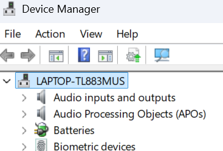

2. Action > Add legacy hardware <br>
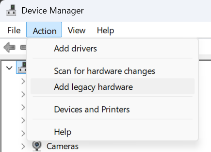

3. Install the hardware that I manually select from a list (Advanced) <br>
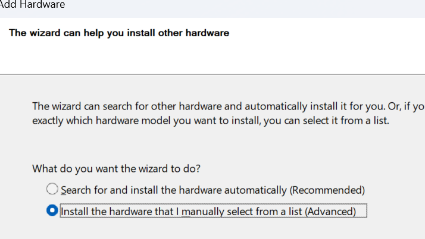

4. Network adapters <br>
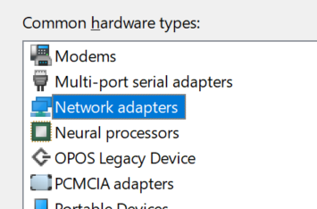

5. Microsoft > Microsoft KM-TEST Loopback Adapter > Next <br>
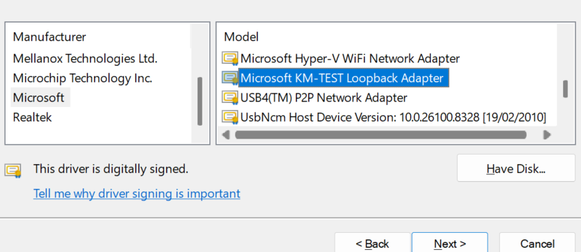

6. The loopback interface is now added. Can view in device manager > network adapters <br>
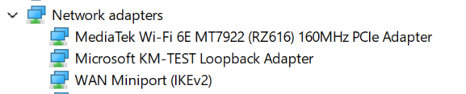 <br>
Or Control Panel > Network & Sharing Center > Change adapter settings <br>
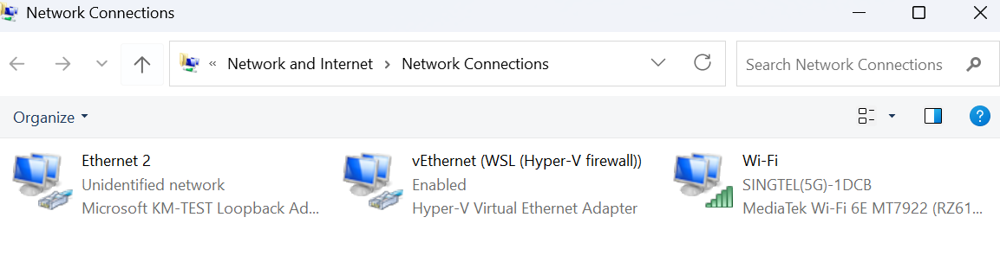

7. Go to Control Panel > Network & Sharing Center > Change adapter settings > Select the loopback interface > Properties > Networking > IPv4 <br>
    - IP Address: 10.0.21.4
    - Subnet Mask: 255.255.255.0 <br>
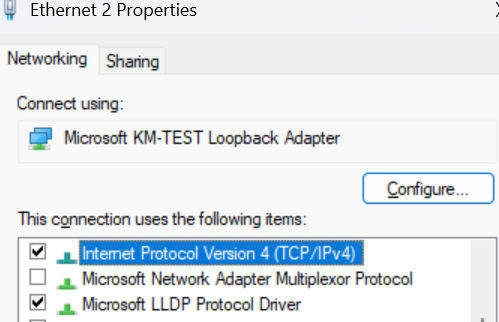
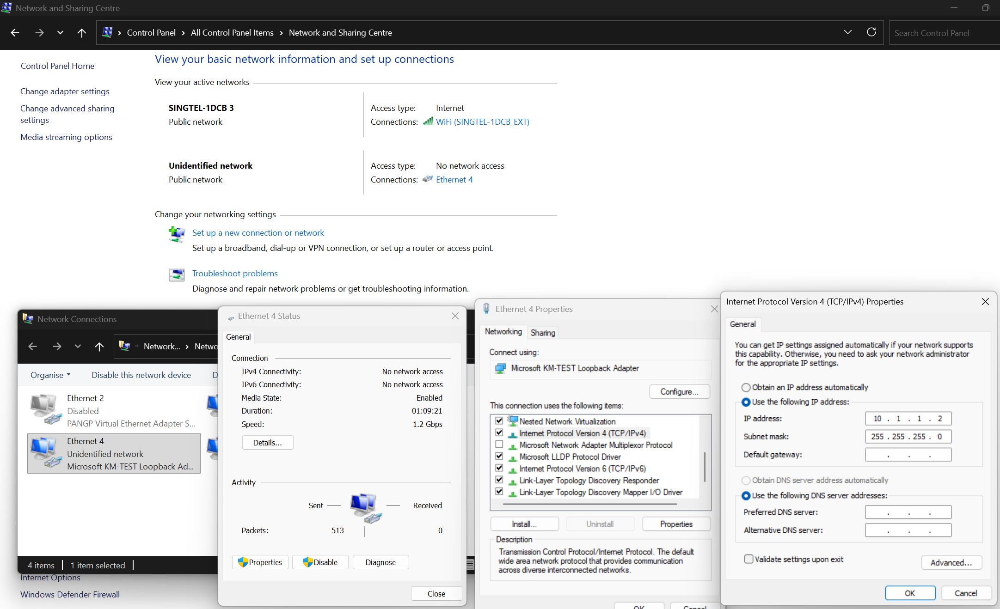

8. Can now ping the IP you set (10.0.21.4 in this case) from cmd and "ipconfig" should show this network adapter <br>
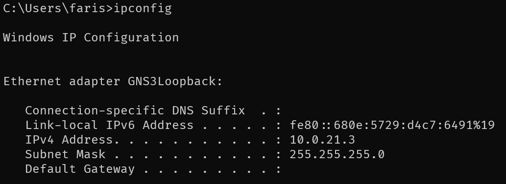 <br>
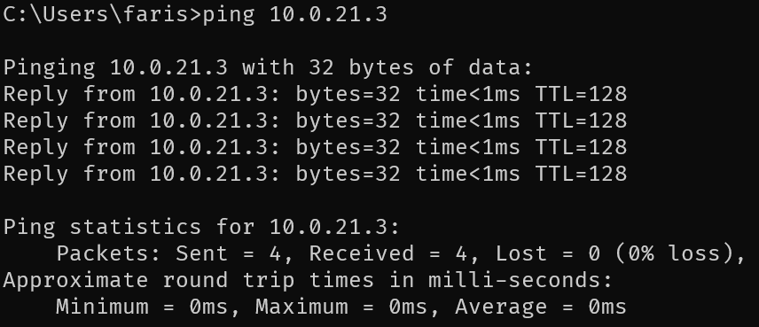
<br><br>


<h1>Windows Firewall Setup</h1>
This is to allow traffic between GNS3, Microsoft KM-TEST Loopback Adapter, Ubuntu VM and local machine.

1. 	Enable the following inbound rules (Right click > Enable)
    - File and Printer Sharing (Echo Request - ICMPv4-In) {Profile: Domain}
    - File and Printer Sharing (Echo Request - ICMPv4-In) {Profile: Private}
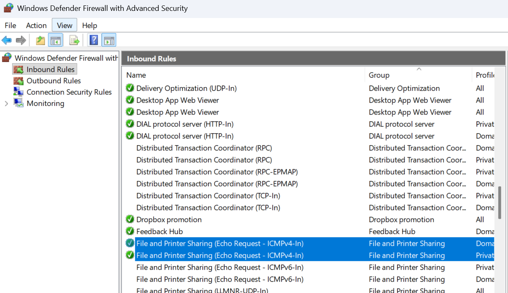

2. Should be able to ping the loopback interface and GNS3 devices that are connected to the loopback interface

3. Else, restart your device
<br><br>


<h1> VirtualBox VM Network Settings</h1>

1. Make sure that GNS3 and the Ubuntu VM is turned off <br>

2. Open VirtualBox > Select Ubuntu VM > Settings <br>
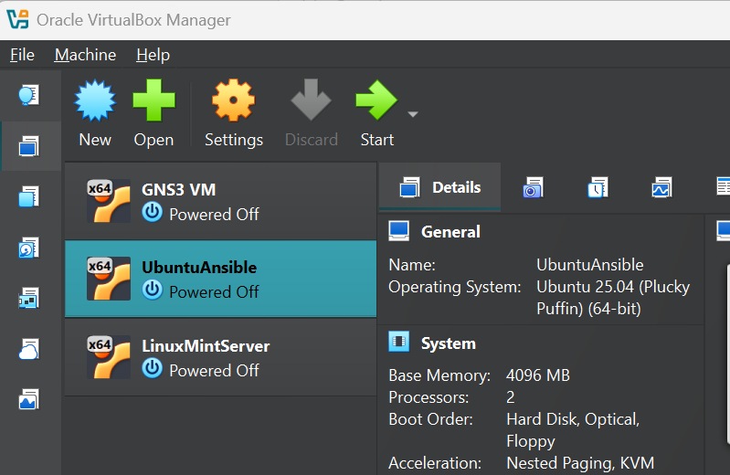 <br>

3. Go to 'Network' <br>
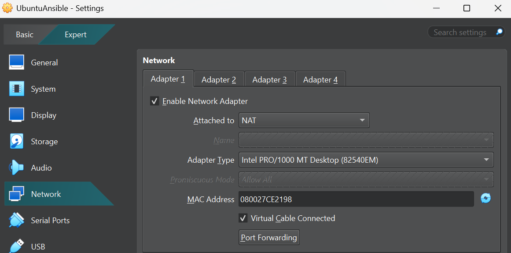 <br>
    - By default, you should see Adapter 1 using NAT <br>

4. Enable Adapter 2 and 3
    - Adapter 2: Internal Network
    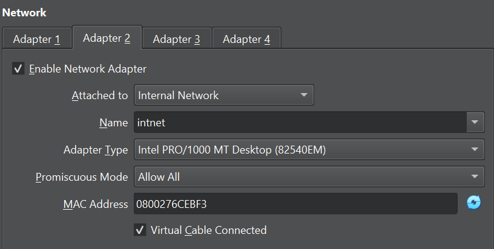 <br>
    - Adapter 3: Bridged Adapter - Microsoft KM-TEST Loopback Adapter
    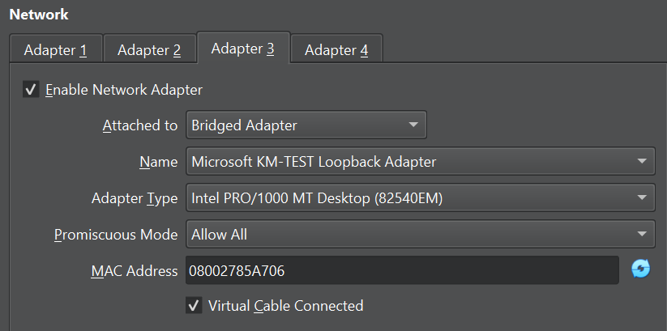 <br>

5. Network settings for Ubuntu is done
6. Open the 'Network' settings for GNS3
7. Enable Adapter 3 and 4
    - Adapter 3: Bridged Adapter
        - Name: Microsoft KM-TEST Loopback Adapter
        - Will be used for a quick test only
    - Adapter 4: Internal Network
        - Make sure the "name" is the same
        - `intnet` if following the example from Ubuntu VM

    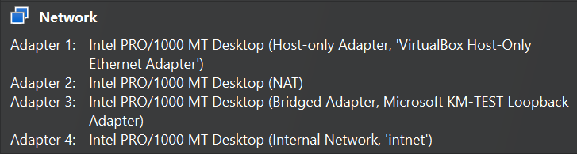 <br>
<br><br>


<h1>GNS3</h1>

1. Run GNS3 and create a new project
2. Setup the devices as shown below 
    - The cloud should be using `GNS3VM`
    - The cloud should have 4 interfaces, `eth0` to `eth3`
    - They are in reference to the network adapters that we setup in previous section. 
        - `eth0`: `Adapter 1` (Host-only Adapter)
        - `eth1`: `Adapter 2` (NAT)
        - `eth2`: `Adapter 3` (Bridged Adapter)
        - `eth3`: `Adapter 4` (Internal Network)
    - We will be connecting to the Internal Network `eth3`
    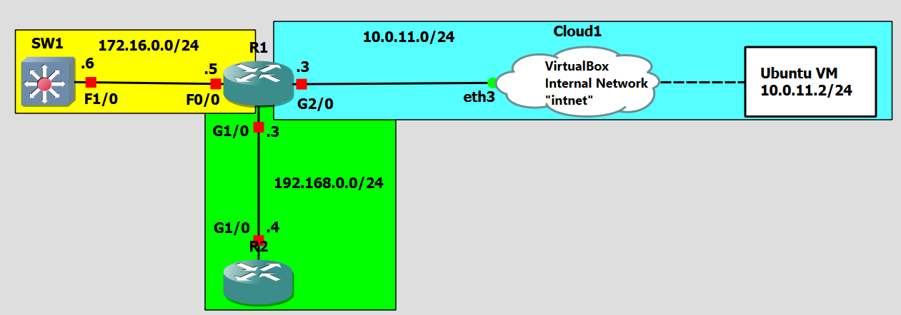
        - Routers: `C7200`
        - Switches: `C3725 EtherSwitch Router`
        - Cannot use IOU images as they don't support SSH
3. Configure IP addresses as shown in the diagram
    - R1
        ```
        interface g2/0
        ip address 10.0.11.3 255.255.255.0
        no shutdown
        interface g1/0
        ip address 192.168.0.3 255.255.255.0
        no shutdown
        interface f0/0
        ip address 172.16.0.5 255.255.255.0
        no shutdown
        do write
        ```
    - R2
        ```
        interface g1/0
        ip address 192.168.0.4 255.255.255.0
        no shutdown
        ```
    - SW1
        ```
        interface vlan 1
        ip address 172.16.0.6 255.255.255.0
        no shutdown
        interface f1/0
        switchport access vlan 1
        ```
4. Ping the other device in the same network to test if working
5. Setup default routes of R2 and SW1 to be R1 interfaces
    - R2
        ```
        ip route 0.0.0.0 0.0.0.0 192.168.0.3
        ```
    - SW1
        ```
        ip routing
        ip route 0.0.0.0 0.0.0.0 172.16.0.5
        ````
6. Ping interface in other networks to test if working
7. Setup SSH for the devices
    - Change the hostname for each device
    - User: `user`
    - SSH password: `cisco123`
    - Become password: `cisco123`

    ```
    hostname SW1
	enable secret cisco123
	ip domain-name domain.com
	crypto key generate rsa 
	2048
	ip ssh version 2
	username user password cisco123
	line vty 0 4
	length 0
	transport input ssh telnet
	login local
	exit
    do write
    ```
<br><br>


<h1>Ubuntu VM Setup</h1>

1. Start the Ubuntu VM with GUI
2. Open Firefox and run an Internet speed test - make sure that you are getting similar speeds as the local device
3. Open `Settings` > Network
    - `enp0s3`: Adapter 1 (NAT - Internet)
    - `enp0s8`: Adapter 2 (Internal Network - Connected to GNS3)
    - `enp0s9`: Adapter 3 (Loopback Adapter - SSH from local device to VM)
4. Click on the gear icon and set the following for these devices
    - `enp0s8` (Internal Network)
        - IPv4 Method: `Manual`
        - IP address: `10.0.11.2` (Same subnet as R1 G2/0)
        - Netmask: `255.255.255.0`
    - `enp0s9` (Loopback Adapter)
        - IPv4 Method: `Manual`
        - IP address: `10.0.21.6` (Same subnet as Microsoft Loopback Adapter)
        - Netmask: `255.255.255.0`
    - Save the settings
5. Open cmd and test ping to R1

    ```
    ping 10.0.11.3
    ```
6. Install `ifconfig` so that we can do a quick check of IP configurations

    ```
    sudo apt update
    sudo apt install net-tools
    ```
7. Install SSH Client so that we can SSH to the network devices

    ```
    sudo apt install openssh-client
    ```
8. Install SSH Server so that we can SSH from local machine to Ubuntu VM. Will be easier when we need to copy and paste commands

    ```
    sudo apt install openssh-server
    ```
9. Restart the SSH service and check if working

    ```
    sudo service ssh restart
    sudo systemctl status ssh
    ```
10. Open your local machine Command Prompt and SSH to the Ubuntu VM

    ```
    ssh faris1702@10.0.21.6
    ```
11. On the Ubuntu VM, press `Ctrl` + `Alt` + `F3` and login back
    - Changes from GUI to CLI only, prevents the Ubuntu VM from sleeping which occurs when using GUI, causing the connection to fail
12. Use VSCode Remote SSH to connect to the Ubuntu VM
    1. Make sure that step 10 is successful before moving to this step
    2. Open VSCode > Extensions > Install `Remote - SSH by  Microsoft`
    3. Open command palette - F1 > `Remote - SSH: Connect to Host` > Add new SSH host
    4. Enter the SSH command `ssh faris1702@10.0.21.6`
    5. To disconnect > Click bottom left > Close Remote connection
13. From this step onwards, use the terminal from within VSCode
14. To be able to SSH to the network devices, we need to add some configurations to the SSH file
    ```
    nano ~/.ssh/config
    ```
    Add the following
    ```
    Host 10.0.11.* 
        KexAlgorithms +diffie-hellman-group14-sha1,diffie-hellman-group-exchange-sha1,diffie-hellman-group1-sha1
        HostKeyAlgorithms +ssh-rsa
        Ciphers +aes256-cbc
        MACs +hmac-sha1

    Host 192.168.0.* 
        KexAlgorithms +diffie-hellman-group14-sha1,diffie-hellman-group-exchange-sha1,diffie-hellman-group1-sha1
        HostKeyAlgorithms +ssh-rsa
        Ciphers +aes256-cbc
        MACs +hmac-sha1

    Host 172.16.0.* 
        KexAlgorithms +diffie-hellman-group14-sha1,diffie-hellman-group-exchange-sha1,diffie-hellman-group1-sha1
        HostKeyAlgorithms +ssh-rsa
        Ciphers +aes256-cbc
        MACs +hmac-sha1
    ```
15. Add routes to `R2` and `SW1` since we are only connected `R1` in the 10.0.21.0/24 network
    - Note: This command will need to be added every time you start the Ubuntu VM
    - I tried making the route permenant but it does not work

    ```
    sudo ip route add 192.168.0.0/24 via 10.0.11.3 dev enp0s8
    sudo ip route add 172.16.0.0/24 via 10.0.11.3 dev enp0s8
    ```
16. Ping to `R2` and `SW1`

    ```
    ping 192.168.0.4
    ping 172.16.0.6
    ```
17. SSH to all the devices
    - Password: `cisco123`

    ```
    ssh user@10.0.11.3
    ssh user@192.168.0.4
    ssh user@172.16.0.6
    ```
<br><br>


<h1>Setup Packet Capture within Ubuntu VM</h1>
One of the features of this project is that the AI agent will be abe to capture network traffic and analyse it. This section will enable this feature.

1. Install `tcpdump` 

    ```
    sudo apt install tcpdump
    ```
2. Make the current Ubuntu VM user sudo (replace `faris1702` with your username)

    ```
    sudo usermod -aG sudo faris1702
    ```
3. Remove the password request when running `tcpdump` commands
    - Prevents error when the AI Agent runs this function
    1. Check the path of `tcpdump` using
   	```
	which tcpdump
    ```
    Should give an output like `/usr/bin/tcpdump` <br>
    2. Access `visudo`
		```
		nano visudo
		```
    3. Go to the last line and add

        ```
        faris1702 ALL=(ALL) NOPASSWD: /usr/bin/tcpdump
        ```
        - Replace `faris1702` with your username
        - Replace `/usr/bin/tcpdump` with the output of Step 1
    4. Check if working

        ```
        sudo -l
        sudo -k
        sudo tcpdump -ni enp0s3 -c 1
        ```
        - Should work without asking for password
4. Some `tcpdump` commands
    - Check available interfaces

        ```
        tcpdump -D
        ```
    - Capture the traffic and save to file

        ```
        sudo tcpdump -ni <interface> -c <packet count> -w <filepath>.pcap
        ```
        - `-n` flag: won't resolve IP addresses to hostnames
    - Read pcap files

        ```
        tcpdump -r <filepath>
        ```
<br><br>


<h1>Coding Environment Setup</h1>

1. Create a directory for the project

    ```
    mkdir AI_Agent_Network_Automation
    ```
2. Install Python

    ```
    sudo apt update && sudo apt install python3 python3-pip python3-venv
    ```
    Check working

    ```
    python3 --version
    ```
3. Install Ansible

    ```
    sudo apt install ansible
    ```
    Check working

    ```
    ansible --version
    ```
4. Setup a Python Virtual Environment and activate it

    ```
    cd AI_Agent_Network_Automation
    python3 -m venv venv
    source venv/bin/activate
    ```
5. Create a `requirements.txt` file 

    ```
    nano requirements.txt
    ```
6. Copy the content of this repo's `requirements.txt` to your Ubuntu VM `requirements.txt`
7. Install the dependencies into your virtual environemnt

    ```
    pip install -r requirements.txt
    ```
8. Check if Python and ansible is sourced from the virtual environment

    ```
    which python3
    which ansible
    ```
    Should return a path from your venv `...\AI_Agent_Network_Automation\venv\....`
<br><br>


<h1>OpenAI API Key / LLM Interface Setup</h1>

1. Make sure you have an existing API key
    - If you don't have, [OpenAI Platform](https://platform.openai.com/) allows you to create one
    - Note: It is not free, but it is very cheap. I would highly recommend since OpenAI is easy to use and I used it for this project

2. In the project folder, create a `.env` file

    ```
    nano .env
    ```
3. Store your API key inside

    ```
    OPENAI_API_KEY="<API_KEY>"
    ```
4. Copy `test_api_key.py` script into your project folder and run
    - You should receive a reply from the LLM without errors
<br><br>


<h1>Ansible Setup</h1>
For this section, we will be setting up Ansible on the Ubuntu VM. To make things simple, you can use the <b>VSCode Remote SSH</b> as mentioned in <b>Step 12</b> of <b>Ubuntu VM Setup</b>

 
1. In your project folder, create a `hosts.ini` file

    ```
    nano hosts.ini
    ```
2.  Enter the following

    ```
    [routers]
    10.0.11.3
    192.168.0.4

    [switches]
    172.16.0.6
    ```
3. Activate your virtual environment if you have not
4. Test Ansible commands to all the devices

    ```
    ansible 10.0.11.3 -m raw -a 'sh ip int br' -u user -k -i hosts.ini
    ansible 192.168.0.4 -m raw -a 'sh ip int br' -u user -k -i hosts.ini
    ansible 172.16.0.6  -m raw -a 'sh ip int br' -u user -k -i hosts.ini
    ```
    The output should be similar to the picture below
    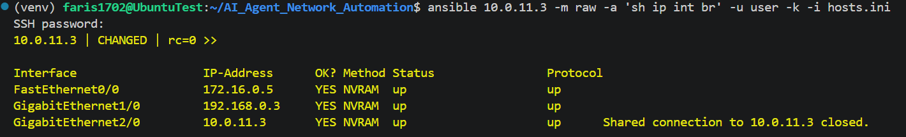
5. If Step 4 works, it means that Ansible is working properly
6. Modify `hosts.ini`

    ```
    nano hosts.ini
    ```
    And change it to the following

    ```
    [routers]
    R1 ansible_host=10.0.11.3
    R2 ansible_host=192.168.0.4

    [routers:vars]
    ansible_connection=ansible.netcommon.network_cli
    ansible_network_os=cisco.ios.ios
    ansible_become=yes
    ansible_become_method=enable

    [switches]
    SW1 ansible_host=172.16.0.6

    [switches:vars]
    ansible_connection=ansible.netcommon.network_cli
    ansible_network_os=cisco.ios.ios
    ansible_become=yes
    ansible_become_method=enable
    ```
7. We will now create a new directory `host_vars` with subdirectories within it. This will store the network devices user and password information.<br>

    ```
    mkdir host_vars
    cd host_vars
    mkdir R1
    mkdir R2
    mkdir SW1
    ```
    Below is the file structure of `host_vars`. Don't create `vault.yaml`.
    ```
    AI_Agent_Network_Automation
        └── host_vars
               ├── R1
               │   └── vault.yaml
               ├── R2
               │   └── vault.yaml
               └── SW1
                   └── vault.yaml
    ``` 
8. <b>Optional</b>: Change the default editor from `vim` to `nano`. I did this as I was more comfortable with `nano`

    ```
    nano /home/faris1702/.bashrc
    ```
    Go to the last line and add

    ```
    export EDITOR=nano
    ```
    Apply the changes

    ```
    source ~/.bashrc
    ```
    Your virtual environment will be deactivated after this step. You will need to activate it again

    ```
    source venv/bin/activate
    ```
9. Create an Ansible Vault for each host directory

    ```
    ansible-vault create host_vars/R1/vault.yaml
    ansible-vault create host_vars/R2/vault.yaml
    ansible-vault create host_vars/SW1/vault.yaml
    ```
    Enter the password that you want. For my project
    - Password: `password`
    
    Enter the following

    ```
    ansible_user: user
    ansible_password: cisco123
    ansible_become_password: cisco123
    ```
10. From the project directory `../AI_Agent_Network_Automation`, create `.ansible_vault_password`. This will allow Ansible to run commands without requesting for Ansible-Vault password.

    ```
    nano .ansible_vault_password
    ```

    Enter your Ansible Vault password inside

    ```
    password
    ```
11. Test if the setup was done correctly by running Ansible commands
    ```
    ansible R1 -i hosts.ini \
    --vault-password-file .ansible_vault_password \
    -m cisco.ios.ios_command \
    -a "commands='show ip int br'"
    ```
    and
    
    ```
    ansible R1 -i hosts.ini \
    --vault-password-file .ansible_vault_password \
    -m cisco.ios.ios_command \
    -a "commands='show run'"
    ```
12. Do step 11 for all the other hosts - `R2` and `SW1`
<br><br>


<h1>The setup is complete</h1>

You can now copy `ai_agent_5.py` from the repo into the Ubuntu VM and run it. It should work without issue.
